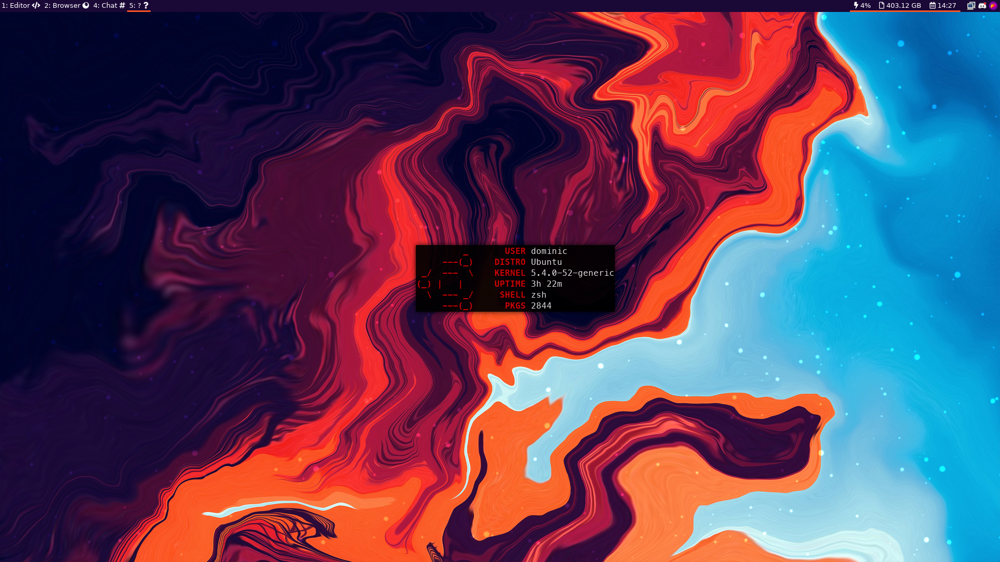

## **.dotfiles**

i3-gaps on Ubuntu



Uses [GNU Stow](https://www.gnu.org/software/stow/)

### **Usage**

To use make sure you have GNU Stow:

Debian: `$ apt install stow`

```
# Go to your home dir
$ cd ~

# Clone the repo
$ git clone https://github.com/Domterion/.dotfiles

# Go into dotfiles repo
$ cd .dotfiles

# Install the desired dotfiles
$ stow polybar (or i3, x, zsh, compton, nvim, rofi)
```

### **Details**

**Wallpaper**

Wallpaper used is called "background.jpg", the theme is based around this. If youre going to use it, make sure the mode is tiling.

**All the things**:

**[compton](https://github.com/chjj/compton)** - compositor 

**[i3-gaps](https://github.com/Airblader/i3)** - tiling WM

**[neovim](https://github.com/neovim/neovim)** - text editor

**[polybar](https://github.com/polybar/polybar)** - status bar to replace i3bar

**[rofi](https://github.com/davatorium/rofi)** - dmenu replacement

**[zsh](https://github.com/zsh-users/zsh)** - shell of choice

**Fonts**

**[font-awesome](https://github.com/FortAwesome/Font-Awesome)** - used for polybar icons and i3bar if used

**[system san francisco](https://github.com/supermarin/YosemiteSanFranciscoFont)** - i3 font and rofi

**[JetBrainsMono Regular](https://www.jetbrains.com/lp/mono/)** - polybar


